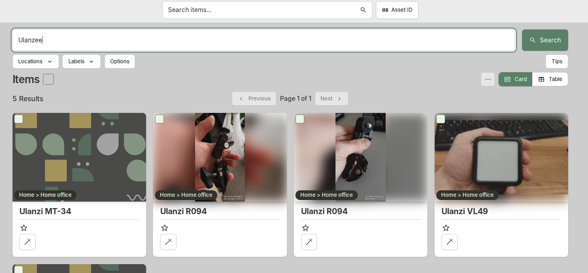
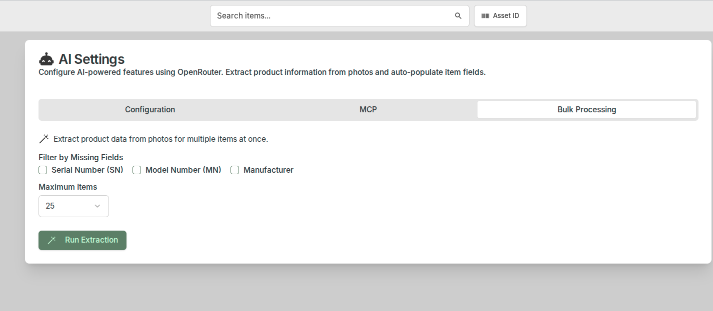

# Where's My Stuff?

A customised fork of [Homebox](https://github.com/sysadminsmedia/homebox), the home inventory system.

## About

Where's My Stuff (WMS) is an entirely vibe-coded fork of Homebox, undertaken by Claude under my supervision. Like all vibe-coded projects, WMS is offered on a "might work" basis.

When/if I have something stable-ish to share, I will do so here.

## Why Fork?

Homebox has a dedicated team of contributors. I wanted to add some niche features that I doubted would interest the broader user community. In the interest of streamlining the codebase, I also removed some features I didn't need—most significantly, replacing barcode/label support with NFC.

Creating a derivative fork for my own use made more sense than sending back PRs of dubious code quality. Vibe coding is scrappy! The main project may wish to integrate any of these features, or not.

## Documentation

Full documentation available at **[danielrosehill.github.io/Wheres-My-Stuff](https://danielrosehill.github.io/Wheres-My-Stuff/)**

## Summary of Changes

*Forked from Homebox on 13 December 2025. See [full changelog](https://danielrosehill.github.io/Wheres-My-Stuff/changes/) for detailed implementation notes.*

### Search & Retrieval
- **Semantic search** with embeddings and vector support for AI-powered retrieval
- **Streamlined asset lookup** — numeric queries treated as asset IDs, text queries as keyword searches

### Data Structure Improvements
- **Lookup tables** for common technical items (cables, connectors, etc.)
- **Vendors & manufacturers** as reusable entities with filtering support
- **Custom field management** via settings to prevent duplicate/inconsistent entries
- **Multi-currency support** — record original purchase currency alongside value

### UI & UX Enhancements
- **Location photos** — photograph storage locations (boxes, shelves, etc.)
- **Favourites** — star frequently-accessed items for quick lookup
- **Spec sheet tab** — dedicated place for spec sheets and product documentation
- **Menu consolidation** — simplified navigation with dropdown sub-menus
- **Dedicated assets page** — direct access without requiring search

### Performance
- **Thumbnail optimisation** — 200px micro-thumbnails for faster list loading
- **Post-upload compression** — automatic image optimisation
- **Database indexing** improvements

### Integrations
- **NFC support** — write/lock NFC tags on mobile devices (replaces barcode/label system)
- **Built-in MCP server** — Model Context Protocol endpoint for AI tool integration
- **OpenRouter integration** — AI features powered by configurable LLMs (default: Google Gemini Flash)
- **API key management** — dedicated utility for long-lived API keys

### Other
- **Parent/child asset decoupling** — UI to unlink related assets

## Implementation Status

Features are being integrated periodically. Not all are fully complete yet.

## Upstream

This fork tracks [sysadminsmedia/homebox](https://github.com/sysadminsmedia/homebox). Features may diverge from upstream as both projects evolve.

## Screenshots

See the [full screenshot gallery](https://danielrosehill.github.io/Wheres-My-Stuff/screenshots/) in the documentation.

