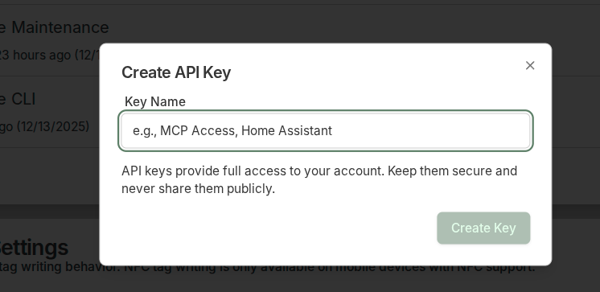

# Integrations

## NFC Support

Implementing NFC support at the desktop level is challenging. There are ways to connect browser-based tools with local processes, but I thought it was needless complication.

Instead, the NFC integration only displays on mobile devices. I added a setting to distinguish between write, and write-and-lock operations. I personally use write-and-lock, which permanently locks tags to prevent accidental rewriting. But for flexibility, I added a simple write feature as well. Write-and-password-protect is a more versatile option and could be added. The feature works nicely on Android devices.

!!! note "NFC replaces Barcodes/Labels"
    This fork removes the barcode/label system in favour of NFC tags. If you need barcode support, use upstream Homebox.

## API Key Management

Homebox has a good API that is defined with a proper schema, but generated tokens created manually are short-lived. I wanted to add a dedicated API key management utility to support integration with AI tools.

<figure class="screenshot" markdown>
  
  <figcaption>Settings interface including API key management</figcaption>
</figure>

## Multi-Currency Support

Homebox allows users to define a currency. Valuing items is potentially very useful for insurance appraisals.

However, practically speaking, when ordering things from the internet many people use multiple currencies. Recording the original currency alongside the value is an important concept because it allows valuations to be centralised on a standard currency with up-to-date exchange rates.

As a first step towards supporting this kind of implementation, the revised format allows users to define their primary currency while supporting currency as a label in fields with financial values.

## Item Lending & Requests

<figure class="screenshot" markdown>
  
  <figcaption>Lend item interface</figcaption>
</figure>

<figure class="screenshot" markdown>
  
  <figcaption>Request item interface</figcaption>
</figure>
