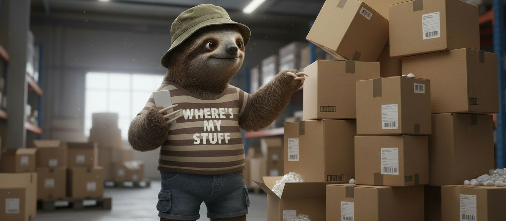
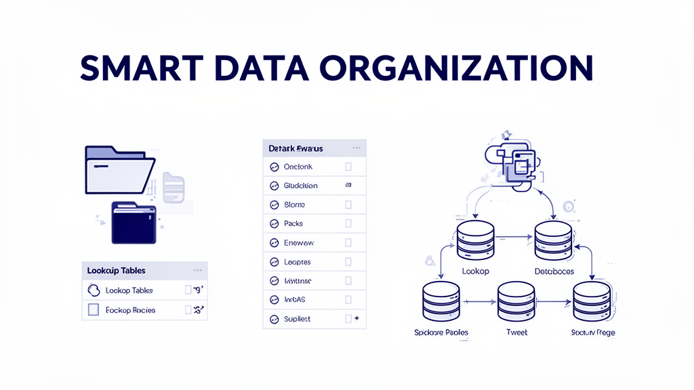
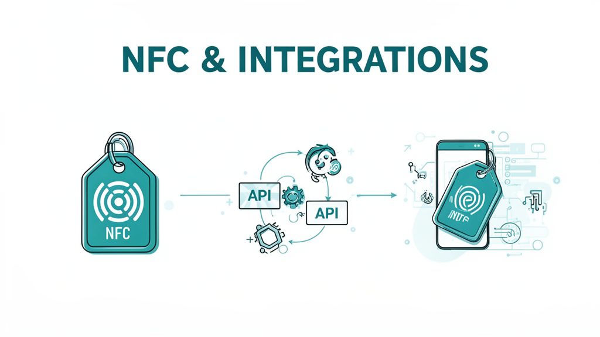

---
meta:
  - property: og:image
    content: https://danielrosehill.github.io/Wheres-My-Stuff/assets/images/og-image-1183x665.png
  - name: twitter:card
    content: summary_large_image
  - name: twitter:image
    content: https://danielrosehill.github.io/Wheres-My-Stuff/assets/images/og-image-1183x665.png
---

  

# Where's My Stuff

A customised fork of [Homebox](https://github.com/sysadminsmedia/homebox), the home inventory system.

## About

Where's My Stuff (WMS) is an entirely vibe-coded fork of Homebox, undertaken by Claude under my supervision. Like all vibe-coded projects, WMS is offered on a "might work" basis.

## Why Fork?

Homebox has a dedicated team of contributors. I wanted to add some niche features that I doubted would interest the broader user community. In the interest of streamlining the codebase, I also removed some features I didn't need—most significantly, replacing barcode/label support with NFC.

Creating a derivative fork for my own use made more sense than sending back PRs of dubious code quality. Vibe coding is scrappy! The main project may wish to integrate any of these features, or not.

## Quick Overview of Changes

<figure markdown="span">
  { width="100%" }
</figure>

<figure markdown="span">
  { width="100%" }
</figure>

<figure markdown="span">
  { width="100%" }
</figure>

| Category | Key Features |
|----------|--------------|
| **Search & Retrieval** | Semantic search, embeddings, streamlined asset lookup |
| **Data Structure** | Lookup tables, vendors/manufacturers, custom field management |
| **UI & UX** | Location photos, favourites, spec sheets, menu consolidation |
| **Performance** | Thumbnail optimisation, post-upload compression |
| **AI Features** | Built-in MCP server, OpenRouter integration |
| **Integrations** | NFC support, API key management, multi-currency |

See the [Changes](changes/index.md) section for detailed implementation notes.

## Implementation Status

Features are being integrated periodically. Not all are fully complete yet.

## Upstream

This fork tracks [sysadminsmedia/homebox](https://github.com/sysadminsmedia/homebox). Features may diverge from upstream as both projects evolve.
