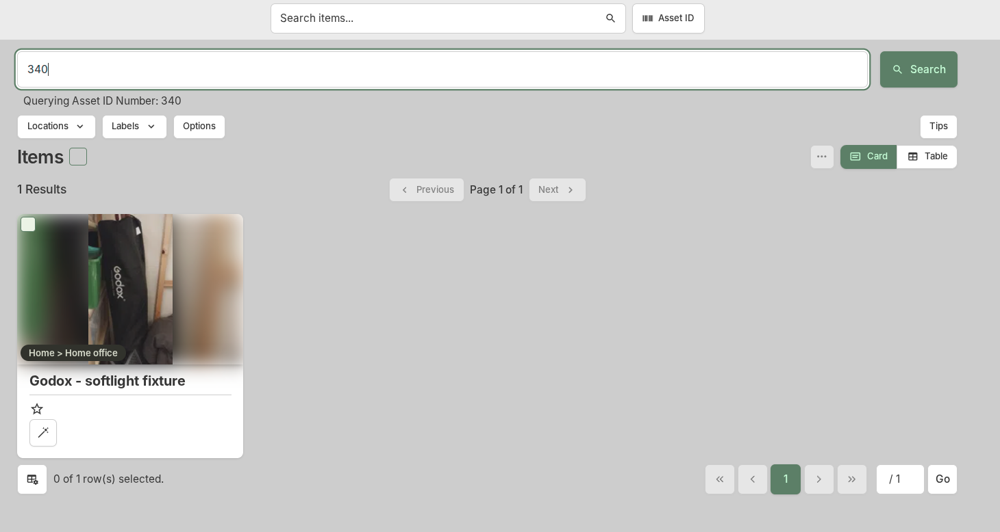
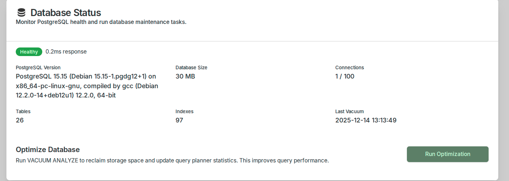
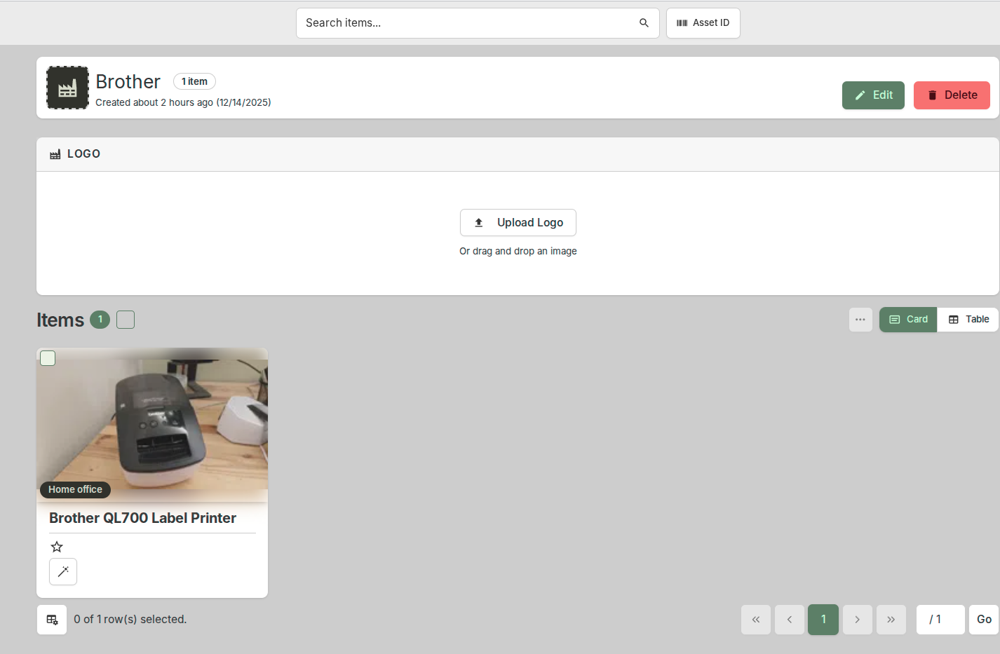
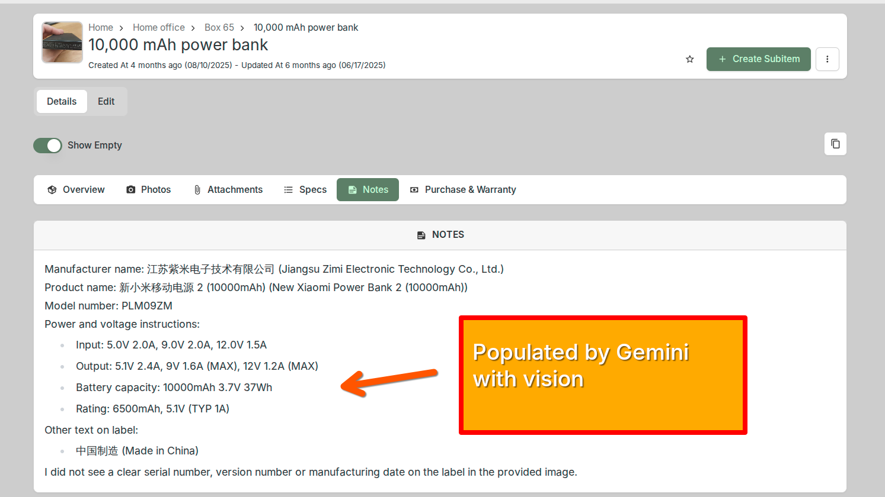
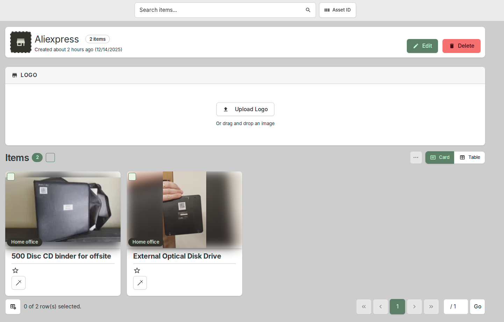

# Screenshots Gallery

## User Authentication

<figure class="screenshot" markdown>
  
  <figcaption>Login Screen</figcaption>
</figure>

<figure class="screenshot" markdown>
  
  <figcaption>Registration Screen</figcaption>
</figure>

<figure class="screenshot" markdown>
  
  <figcaption>Forgot Password Screen</figcaption>
</figure>

<figure class="screenshot" markdown>
  
  <figcaption>Social Login</figcaption>
</figure>

<figure class="screenshot" markdown>
  
  <figcaption>2FA Setup</figcaption>
</figure>

## Item Management

<figure class="screenshot" markdown>
  
  <figcaption>Add Item</figcaption>
</figure>

<figure class="screenshot" markdown>
  
  <figcaption>Add Item With Image</figcaption>
</figure>

<figure class="screenshot" markdown>
  
  <figcaption>Edit Item</figcaption>
</figure>

<figure class="screenshot" markdown>
  
  <figcaption>Delete Item</figcaption>
</figure>

<figure class="screenshot" markdown>
  
  <figcaption>Item Details</figcaption>
</figure>

<figure class="screenshot" markdown>
  
  <figcaption>View All Items</figcaption>
</figure>

<figure class="screenshot" markdown>
  
  <figcaption>Mark as Found</figcaption>
</figure>

<figure class="screenshot" markdown>
  
  <figcaption>Request Item</figcaption>
</figure>

<figure class="screenshot" markdown>
  
  <figcaption>Lend Item</figcaption>
</figure>

## Search and Filter

<figure class="screenshot" markdown>
  
  <figcaption>Search by Keyword</figcaption>
</figure>

<figure class="screenshot" markdown>
  
  <figcaption>Filter by Category</figcaption>
</figure>

<figure class="screenshot" markdown>
  
  <figcaption>Sort Results</figcaption>
</figure>

<figure class="screenshot" markdown>
  
  <figcaption>Advanced Search</figcaption>
</figure>

<figure class="screenshot" markdown>
  
  <figcaption>Location-Based Search</figcaption>
</figure>

<figure class="screenshot" markdown>
  
  <figcaption>Saved Searches</figcaption>
</figure>

<figure class="screenshot" markdown>
  
  <figcaption>Search History</figcaption>
</figure>

## User Profile

<figure class="screenshot" markdown>
  
  <figcaption>View Profile</figcaption>
</figure>

<figure class="screenshot" markdown>
  
  <figcaption>Edit Profile</figcaption>
</figure>

<figure class="screenshot" markdown>
  
  <figcaption>Change Password</figcaption>
</figure>

<figure class="screenshot" markdown>
  
  <figcaption>My Items</figcaption>
</figure>

<figure class="screenshot" markdown>
  
  <figcaption>Notification Settings</figcaption>
</figure>

<figure class="screenshot" markdown>
  
  <figcaption>Privacy Settings</figcaption>
</figure>
